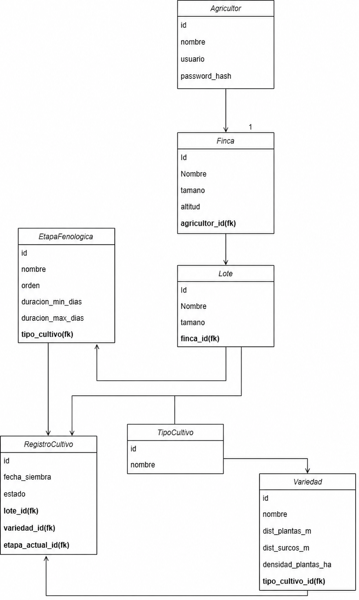

#  Agro+ Backend

> Agricultural management backend for commercial producers in Colombia — built as a learning project while studying Spring Boot from the ground up, under structured code review.


---

## The problem

Many commercial farmers in Colombia manage their operations empirically — without systematic records of what was planted, when, or how a crop is progressing. This leads to three recurring problems:

- **Overspending on inputs**, from applying fertilizer or pesticide based on habit rather than data.
- **Inconsistent yields**, with no historical baseline to compare a season against.
- **Exclusion from formal markets** — cooperatives, certification programs, and rural credit institutions increasingly require traceability that an empirical operation simply can't produce.

**Agro+** addresses this by giving producers a structured way to register their farms and plots, track each planting cycle through its phenological stages, and build the kind of traceable history that formal markets require — starting with coffee, cacao, plantain/banana, and corn, the crops with the strongest commercial footprint in the target region.

---

## Current status

This is an active learning project. Every feature below was built incrementally, reviewed, and tested before moving to the next.

**Implemented**
-  JWT-based authentication (register / login)
-  Farm (`Finca`) and Plot (`Lote`) management, scoped to the authenticated farmer
-  Ownership-based authorization — a farmer can only see and modify their own farms, plots, and crop records
-  Fixed system catalog: crop types, varieties, and phenological stages (seeded on startup)
-  Crop cycle tracking (`RegistroCultivo`): start a planting, auto-assign the initial phenological stage, advance stages strictly in order (no skipping, no going backward)
-  Centralized exception handling with semantically correct HTTP status codes (404 / 403 / 409)

**Designed, not yet implemented**
-  Field activity log (`Actividad`) — fully modeled in the domain design (see ER diagram below) but not yet built into the API
-  Planting capacity calculator (area → estimated plant count)
-  AI-assisted modules (contextual lot assistant, computer-vision disease diagnosis) — being developed separately as an integrable microservice by a teammate (Python + FastAPI)

---

## Architecture

The project follows a **layered architecture**:

```
Controller  →  Service  →  Repository  →  Database
   ↑              ↓
  DTO          Entity
```

- **Controllers** expose REST endpoints and handle HTTP concerns only — no business logic.
- **Services** own all business rules: ownership validation, state checks (e.g. "no duplicate active crop cycle"), and orchestration across repositories.
- **Repositories** (Spring Data JPA) handle persistence, including derived queries that navigate nested relationships (e.g. `findByFinca_Agricultor_Username`).
- **DTOs** decouple the public API contract from the persistence model — request DTOs accept simple IDs, never full entity graphs; response DTOs expose only what the client needs.
- **Entities** model the persisted domain, with explicit `@ManyToOne` relationships and lazy loading.

Authentication and route protection are handled with **JWT + Spring Security**.

### Entity-relationship diagram


 )

---

## Tech stack

| Layer | Technology |
|---|---|
| Language | Java 25 (LTS) |
| Framework | Spring Boot 4.0.6 |
| Security | Spring Security 7 + JWT |
| ORM | Spring Data JPA / Hibernate 7 |
| Database | PostgreSQL 15 (Docker) |
| Build tool | Maven |
| API testing | Postman |
| IDE | IntelliJ IDEA |

---

## Getting started

### Prerequisites
- Java 25 (JDK)
- Docker + Docker Compose
- Maven (or use the IDE's bundled Maven)

### 1. Clone the repository
```bash
git clone https://github.com/andoryupurfire/agroPlusBackend.git
cd agroPlusBackend
```

### 2. Configure environment variables
Copy the example files and fill in your own local values — these are ignored by Git and never committed:

```bash
cp .env.example .env
cp application.properties.example application.properties
```

Edit both files with matching database credentials.

### 3. Start the database
```bash
docker-compose up -d
```

This starts a PostgreSQL 15 container. On first run, the app's `DataInitializer` seeds the fixed catalog (crop types, varieties, phenological stages) automatically.

### 4. Run the application
```bash
mvn spring-boot:run
```

The API will be available at `http://localhost:8081`.

### 5. Test it
Import the provided Postman collection (`postman/AgroPlus.postman_collection.json`) or use the endpoint reference below. Start with `POST /api/auth/register` to create a user and get a JWT — every other endpoint requires it.

---

## API reference

All endpoints except `/api/auth/**` require a valid JWT in the `Authorization: Bearer <token>` header.

### Authentication
| Method | Endpoint | Description |
|---|---|---|
| `POST` | `/api/auth/register` | Registers a new farmer. Validates the username is unique, hashes the password with BCrypt, returns a JWT. |
| `POST` | `/api/auth/login` | Authenticates an existing farmer and returns a JWT. |

### Farms (Fincas)
| Method | Endpoint | Description |
|---|---|---|
| `POST` | `/api/fincas` | Creates a farm owned by the authenticated farmer. |
| `GET` | `/api/fincas` | Lists the farms belonging to the authenticated farmer. |

### Plots (Lotes)
| Method | Endpoint | Description |
|---|---|---|
| `POST` | `/api/lotes` | Creates a plot inside an existing farm. Validates the farm exists and belongs to the authenticated farmer before saving. |
| `GET` | `/api/lotes` | Lists the plots across all of the authenticated farmer's farms. |

### Crop cycles (RegistroCultivo)
| Method | Endpoint | Description |
|---|---|---|
| `POST` | `/api/registroCultivo` | Starts a crop cycle on a plot. Validates plot ownership and that no other active cycle exists on it, then auto-assigns the initial phenological stage (`orden = 1`) based on the chosen variety's crop type. |
| `PATCH` | `/api/registroCultivo/{id}/avanzar-etapa` | Advances the crop cycle to its next phenological stage, in strict sequential order. Returns `409 Conflict` if it's already at the last stage. |

### System catalog
| Method | Endpoint | Description |
|---|---|---|
| `GET` | `/api/catalogos/cultivos` | Lists all crop types in the system catalog. |
| `GET` | `/api/catalogos/cultivos/{cultivoId}/variedades` | Lists the varieties of a given crop type, with planting distances and density. |
| `GET` | `/api/catalogos/cultivos/{cultivoId}/etapas` | Lists the phenological stages of a given crop type, ordered by sequence. |

---

## Error handling

Errors are handled centrally through a `@RestControllerAdvice`, which maps custom domain exceptions to semantically correct HTTP status codes — instead of every failure collapsing into a generic error:

| Exception | HTTP Status | Example |
|---|---|---|
| `RecursoNoEncontradoException` | `404 Not Found` | Requested farm, plot, or crop cycle doesn't exist |
| `AccesoNoAutorizadoException` | `403 Forbidden` | Farmer tries to act on a resource they don't own |
| `ReglaDeNegocioException` | `409 Conflict` | Plot already has an active crop cycle, or crop cycle is already at its last stage |

---

## Technical highlights

- **Ownership enforced at every level of nesting.** Authorization isn't just "is this user logged in" — plot creation validates farm ownership, crop-cycle creation validates plot → farm → farmer ownership, all compared by ID rather than object equality.
- **Derived queries across nested relationships** (`findByFinca_Agricultor_Username`) instead of manual JPQL, letting Spring Data JPA generate the SQL from the method signature.
- **Explicit `@Transactional` boundaries** around any service method that navigates lazy-loaded relationships beyond the initial query, avoiding `LazyInitializationException` while keeping `spring.jpa.open-in-view=false` (no session left open for the entire request lifecycle).
- **Request/response DTOs never leak entities.** Request DTOs accept plain IDs (`Long`) for relationships; response DTOs expose only IDs, never nested object graphs — preventing circular serialization and over-exposing internal data.
- **Idempotent, duplicate-safe seed data.** The catalog initializer checks for existing records before inserting, so restarting the app never creates duplicate crop types, varieties, or stages.

---

## Roadmap

- [x] JWT authentication
- [x] Farm & Plot management with ownership security
- [x] Crop catalog (types, varieties, phenological stages)
- [x] Crop cycle lifecycle (start → advance stages)
- [x] Centralized exception handling
- [ ] Planting capacity calculator
- [ ] AI module integration (contextual assistant, disease diagnosis)
- [ ] Frontend 

---

## Author

**Andres** — Colombian university student and backend developer.
Built as both a learning project and a portfolio piece while studying Spring Boot, PostgreSQL, and REST API design in depth.
